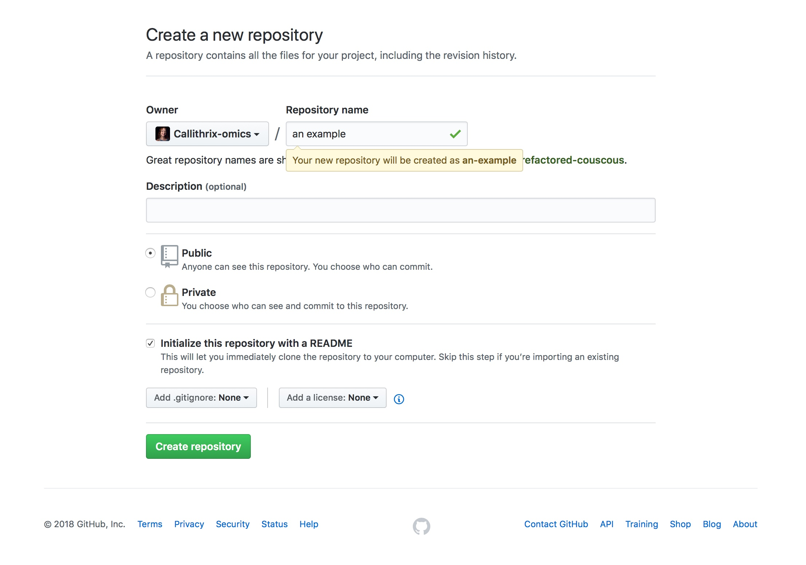
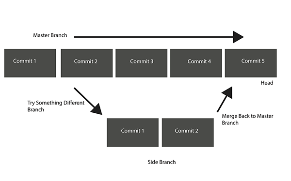

# Introduction to Version Control and Git 
# Joanna Malukiewicz
# AGAR 2018 

## 1. What is Version Control 


Version controls refers to a system that lets you track changes to a file or set of files. 

Over time, earlier versions of these files are able to be recalled at future time points. 

Here this will be a brief introduction to Git and Github for version control. 

Every time you save the state of a project, Git takes a snapshot of what all your files look like at that moment and stores that snapshot as a reference.

Git commits (or saved snapshot) allow past versions of saved material to be reproduced and rolled back. With the commit command, Git takes everything we have told it to save by using git add and stores a copy permanently inside the special .git directory. This permanent copy is called a commit (or revision) and its short identifier is f22b25e. Your commit may have another identifier.

Git helps keep track of important changes to code, files , and directories.

Git helps maintain continuity in a project as well as a record of project history.

A repository (or repo) houses the commits of a particular project. Repos can be sync'd across different computers which allows for collaboration among colleagues and even strangers!

## 2. Setting up Git after Installation and Getting a Git Repo 

Git config allows for configuration and personalization of Git

```
#set identify
$ git config --global user.name "John Doe"
$ git config --global user.email johndoe@example.com

#check settings 
$ git config --list
```
make directory "my\_git\_repo" and then change into that directory 

```
$ mkdir my_git_repo
$ cd my_git_repo
$ git init
```
The git init command forms a git repo skeleton 
Then there are commands to start version tracking 

```
$ nano README.txt
$ git add README.txt
$ git commit -m 'initial project version'
$ ls -a
$ git status

```

The git add commands starts tracking a new file. 

ls -a will list all hidden and unhidden directory and files including the hidden .git sub-directory which contains the repo's history. 

it is also placed into the "staging area," or waiting area of updated, modified, newly tracked, etc files prior to "committing" these modifications to Git. 

The git status command lets you check the state of these various factors within the repo. 

the git commit command creates a snapshot for Git that will go into the history of updates for these files. 

the -m flag allows you to add an informative message for the commit you are making. Using a text editor is an alternative to using the -m flag.

NB: If you modify a file after you run git add, you have to run git add again to stage the latest version of the file.

To stop tracking a file under Git, use the git rm command does. 

However, this command  also removes the file from your working directory.

Another option would be to stop tracking the file but let it stay in the directory. 

For that use the command "git rm --cached".

```

$ git rm --cached README.txt
$ git status 
$ git add README.txt 
$ git commit -m "add back README" 

```

With the commit command, Git will store everything saved by git add permanently inside the  .git sub-directory. This permanent copy is what we mean by a commit. 

Re-open your file, add in new text, and see if you can make the next commit on your own. Issue a git status command, add the modified file, issue another status command. 

Issue a git diff command. What happens? 

Then continue with the commit, and status commands. Did you succeed?  

## 3. Intro to Remote Repositories 

Git allows work to be moved between two repositories. Github allows one of those repositories to be located centrally on the web and another copy on a laptop.

After creating a GitHub account (which you all should have done), I initialized a new repo for the workshop on Github's end. You can click "initialize this repository with a README" for a "quick set-up."


Next you will set up a local version of the repo on your computer, of which you will create a local "clone." This can be done implicitly with the git clone command. 

```
$ git clone https://github.com:Sagui-omics/AAAGs_2018.git
$ git remote -v
```
The git remote command lists your current remote repositories.

"Origin" is a local (and highly common) nickname for your remote repository. It is also the default name Git gives to servers from which you cloned a repo. 

You do have the option to use something else when you set up a remote repo with git remote add <shortname> <url>. This step can be done explicitly with the following steps. 

```
$ git remote add not_a_clone https://github.com:Sagui-omics/AAAGs_2018.git
$ git remote -v
```

Then use the git fetch command to retrieve all the info that is on the other repository but that is not yet in your repository. 

```
git fetch not_a_clone
```

Afterward, git fetch origin will retrieve  any new work that has been pushed to that server from which you last cloned or fetched.

Additionally commands of which to be aware: 

```
$git pull origin master
```

git pull fetches data from the server you originally cloned from and automatically tries to merge it into the code you’re currently working on.


```
$ git push origin master
```
Once you have added and committed your files and are ready to deposit them to the online centralized repository, you will use the 


git push command. 


## 4. (Really Short) Intro to Git Branching 


In Git, the default branch where your main line of commits is maintained the master branch. 

If you want to try out something different before incorporating it into the master branch, you can create a new branch. 

Depending on what branch you'd like to work on, you will "checkout" that branch in git. 

Once you are happy with your changes, you can merge the side branch to your main branch. 

The branch that you are currently working on is referred to as the "Head" in Git.  


## Resources and References for This Presentation 
https://swcarpentry.github.io/git-novice/


Greg Wilson: "Software Carpentry: Getting Scientists to Write Better
Code by Making Them More Productive".  Computing in Science &
Engineering, Nov-Dec 2006.

ProGit book (available free online)


