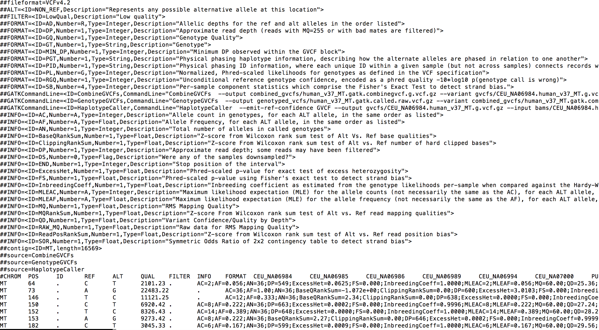
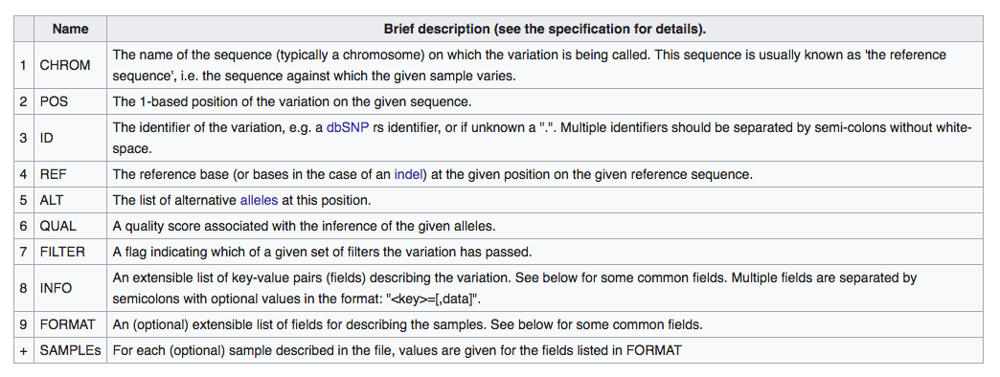
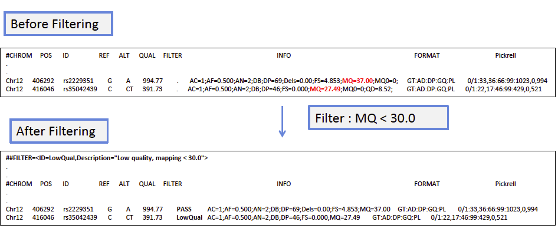
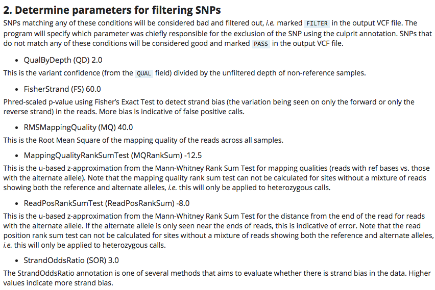
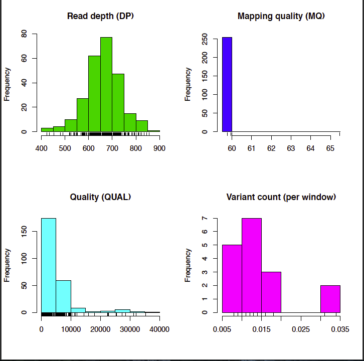

# AGAR 2018 
## Session 3: VCF format, variant filtering and vcftools
## By Maria A. Nieves Colón - July 2018

&nbsp;

------------------

## 1. The VCF format
The variant call format (VCF) is a text file that contains information on DNA polymorphisms. It was developed as a way to efficiently store variant call data from large-scale efforts such as the 1000 Genomes Project. VCF files have three main sections: meta-information lines (indicated by double ##), a header line (indicated by a single #) and data lines (this is the body of the VCF, each line corresponds to a variant). Let's identify each of these sections by looking at the output VCF from session 2 as en example:

&nbsp;



&nbsp;

I created this view of the VCF using the `less` command. Less is a text editor that allows you to view, but not change a file, and the `-S` flag eliminates text wrapping. You can replicate the same view in your terminal as follows:
```
less -S genotyped_vcfs/human_v37_MT.gatk.called.raw.vcf
```
&nbsp;

**Meta-information lines** describe tags used in the VCF body text and convey information on how the genotype calls were generated. Let's look at the first six lines in our VCF as an example. You can view these in your terminal using the `head` command.  

```
head -n6 genotyped_vcfs/human_v37_MT.gatk.called.raw.vcf

##fileformat=VCFv4.2
##ALT=<ID=NON_REF,Description="Represents any possible alternative allele at this location">
##FILTER=<ID=LowQual,Description="Low quality">
##FORMAT=<ID=AD,Number=R,Type=Integer,Description="Allelic depths for the ref and alt alleles in the order listed">
##FORMAT=<ID=DP,Number=1,Type=Integer,Description="Approximate read depth (reads with MQ=255 or with bad mates are filtered)">
##FORMAT=<ID=GQ,Number=1,Type=Integer,Description="Genotype Quality">
```
&nbsp;

The first line always indicates the VCF format and version. From then on we have several lines describing  entries found in the body of the VCF under the INFO, FORMAT and FILTER columns (columns are listed in the header, more on these shortly). Usually these lines follow a key=value pair structure. For instance, the third line indicates that under column FILTER we may see a `LowQual` tag, which indicates that a called variant has low quality. The fourth line indicates that under the FORMAT column we can find the `DP` tag which indicates the read depth at the listed variant. The INFO meta-information lines describe general characteristics of each variant, the FORMAT lines describes how the genotype data is formatted and the FILTER lines describe what filtering procedures, if any, have already been performed on the dataset.

Meta-information lines can also list the commands used to generate the VCF. For example lets look at lines 14-16 in our file. You can select these lines in your terminal using the `sed` command. Note that this will show the complete line which is very, very long! Here I am only showing the first few characters to make it easier to visualize:

```
sed -n '14,16p' genotyped_vcfs/human_v37_MT.gatk.called.raw.vcf 

##GATKCommandLine=<ID=CombineGVCFs,CommandLine="CombineGVCFs  --output combined_gvcfs/human_v37_MT.gatk.combinegvcf.g.vcf.gz --variant gvcfs/CEU_NA06984.human_v37_MT.g.vcf
##GATKCommandLine=<ID=GenotypeGVCFs,CommandLine="GenotypeGVCFs  --output genotyped_vcfs/human_v37_MT.gatk.called.raw.vcf.gz --variant combined_gvcfs/human_v37_MT.gatk.com
##GATKCommandLine=<ID=HaplotypeCaller,CommandLine="HaplotypeCaller  --emit-ref-confidence GVCF --output gvcfs/CEU_NA06984.human_v37_MT.g.vcf.gz --input bams/CEU_NA06984.h
```

&nbsp;

These lines would be especially useful if we had received a VCF file for analysis without knowing how the data was processed. VCF files can be generated as output using many programs, in our case the VCF file was output by GATK, but other variant callers such as SAMtools/bcftools or FreeBayes can also generate VCF files. Thus, adding a meta-information line describing the command used to generate this file is a great way to keep track of how the variant calls were generated. Other meta-information lines such as contig or assembly fields, which provide information on which reference genome was used, can also be included.

&nbsp;

Let's move on to the **header**. This is the only line that starts with a single # symbol. The header lists the columns or fields used in the VCF body. There are eight fixed columns and an unlimited number of additional columns, one per sample, containing the genotype information. The Wikipedia entry for VCF has a great table describing the fixed columns, so I am reproducing it here: 




&nbsp;

Now that we understand how the VCF file is organized, lets examine one variant in more detail as an example.  We can use `sed` to select just the header and the first subsequent line (lines 40 and 41 respectively). We then use a pipe symbol `"|"` to pass the output of this first command into the second `cut` command and obtain just the first 8 columns (no genotype information):

```
sed -n '40,41p' genotyped_vcfs/human_v37_MT.gatk.called.raw.vcf | cut -f1-8

#CHROM	POS	ID	REF	ALT	QUAL	FILTER	INFO
MT	64	.	C	T	2101.23	.	AC=2;AF=0.056;AN=36;DP=549;ExcessHet=0.0625;FS=0.000;InbreedingCoeff=1.0000;MLEAC=2;MLEAF=0.056;MQ=60.00;QD=25.36;SOR=1.157
```
&nbsp;

Based on this information we can see that the first entry is for a variant found at position 64 of the mitochondrial genome. We do not have a known ID for this variant, so the entry for the third column is blank. From looking at columns 4 and 5, we learn that the reference allele at this position is a C but the alternate allele is a T. The number in the QUAL column is the phred-scale quality score for the alternate allele. The higher this value the more confident we can be in the variant call. At this point we have not performed any filtering for our data so the entry for the FILTER column is blank.

Now let's look at the INFO column.  Remember that INFO tags are shown in key=value format and separated by semicolon `;`. By consulting the meta-information lines we can interpret the values provided here and conclude that for this variant:

* `AF=0.056`: The frequency of the alternate allele across all samples is 0.056. 
* `DP=546`: The combined read depth at this site for all samples is 546x.
* `MQ=60.00`: The root mean square of the mapping quality at this site is 60. This is an estimation of the overall mapping quality of all reads that support this variant call.
* `QD=25.36` Variant Confidence/Quality by Depth = 25.36. This value normalizes the QUAL score by the depth and it goes from 0 to 40.

There are many other tags provided in the INFO field. But just by looking at these four we can already gain a sense of the quality of our data. To read about all the potential tags that could be included we can consult the VCF format specification (available here: https://samtools.github.io/hts-specs/VCFv4.2.pdf). We can also look at this guide which lists specific tags added by the GATK HaplotypeCaller to all its output VCFs (available here: https://software.broadinstitute.org/gatk/documentation/article?id=11005). Note that different variant callers may add specific annotations to the VCF, therefore it is important to always consult all program documentation.

&nbsp;

Lastly, let's look at the FORMAT and sample genotype columns. Again, we can use `sed` and `cut` to extract information from the header line and the first data line, but this time we will only include the FORMAT column (9th) and genotype data for the first three samples in our dataset (columns 10-12):
```
sed -n '40,41p' genotyped_vcfs/human_v37_MT.gatk.called.raw.vcf | cut -f9-12

FORMAT	CEU_NA06984	CEU_NA06985	CEU_NA06986
GT:AD:DP:GQ:PGT:PID:PL	0/0:21,0:21:60:.:.:0,60,900	0/0:32,0:32:87:.:.:0,87,1305	0/0:15,0:15:42:.:.:0,42,630
```
&nbsp;

The FORMAT column is telling us how the genotype information is organized for all samples. Specifically, what data types are shown and in what order. The fields are divided by colons `:`. The first field is always `GT`, which contains the actual genotype information. This is encoded as allele values separated by `/` for unphased calls or `|` for phased calls, respectively. The allele values are encoded as numbers: 0=reference allele, 1=first alternate allele, 2=second alternate allele, etc...In the example  above  all three individuals have unphased genotypes `0/0`. By consulting the REF field for this variant, we can translate this to homozygous genotypes `CC` (see above). 

&nbsp;

Other informative fields present in the genotype columns are: `DP`, the read depth at this position and `GQ`, the conditional genotype quality expressed as phred quality. As with the QUAL score, a high GQ value suggests high confidence in the genotype call. As you can see in this example, our GQ values are >40 for all individuals at this variant. Is this a good score? Let's look at a table of Phred score values and see:

| Phred Quality Score| Pr(incorrect call) | Call accuracy|
|--------------------|--------------------|--------------|
| 10 | 1 in 10 | 90% | 
| 20 | 1 in 100 | 99% |
| 30 | 1 in 1000 | 99.9% |
| 40 | 1 in 10,000 | 99.99% |
| 50 | 1 in 100,000 | 99.999% |
| 60 | 1 in 1,000,000 | 99.9999% |

What is the probablility of an incorrect genotype call for the first sample? What about the second one? Is the data looking pretty good so far? 

&nbsp;

#### Resources for further reading:
* From the 1000 Genomes: http://www.internationalgenome.org/wiki/Analysis/vcf4.0/
* On annotations and tags added by GATK variant callers to VCF files: https://software.broadinstitute.org/gatk/documentation/tooldocs/3.8-0/index
* On Phred scores and NGS data: https://www.illumina.com/documents/products/technotes/technote_Q-Scores.pdf).
* Other tutorials: https://faculty.washington.edu/browning/intro-to-vcf.html and https://www.ebi.ac.uk/training/online/course/human-genetic-variation-introduction/exercise-title/want-know-how-we-did-it

&nbsp;

------------------

## 2. Filtering variant calls

Once our genotypes have been called, the next step is to filter the variant calls. Filtering allows us to select for analysis only those variants that pass certain thresholds. Which thresholds to use will depend on the research goals, the hypotheses to test and the types of data being used. Filtering can be applied at the variant (INFO tags) or genotype level (FORMAT tags). Most filtering approaches seek to exclude low quality variants or low confidence genotype calls, but from then on the filtering scheme may vary depending on the project. For some studies, it may be more desirable to filter out false positives than negatives, and for others it may be the other way around. For instance, filtering approaches used for high-quality whole genome data, such as selecting only variants with high read depth, cannot be used with low-coverage ancient DNA datasets. So, just to recap, **there is no universal approach towards variant filtering, and when you get to this stage with your own data you must think carefully about what the outcome of your filtration will be and what thresholds make the most sense for your research goals**. 

&nbsp;


### Soft filtering
Soft filtering consists of annotating the FILTER column with PASS or FILTER tags. **No variants are eliminated from the file**. To illustrate how this is performed below is a screenshot of a presentation by N. Lapalu of BIOGER where you can see an example of a VCF file before and after soft filtering (for full presentation see links below). In this example soft filtering was performed on the MQ tag (RMS mapping quality), within the INFO field. Thus, only variants with MQ values above the 30.0 threshold are annotated with the PASS tag in the FILTER field. 



 

The GATK Best Practices workflow guidelines (available here: https://software.broadinstitute.org/gatk/best-practices/) recommends using recalibration and soft filtering to identify potential false positives and other biases that may arise from sequencing data. The GATK provides a tool called VariantRecalibrator which uses machine learning to recalibrate quality scores of variant calls. Scores are assessed through a model which is trained by looking at known sites in existing large-scale genomic datasets (such as HapMap3 or 1000 Genomes). Although this is a very valuable approach, it requires a large and well curated  variant database, which may not be available for non-model organisms. Additionaly, this tool does not work well for small genomic targets such as the mitochondrial genome. Therefore, today we will use a different approach. However, if you are interested in learning more about variant recalibration and how it may be useful for your data, check out the resources listed at the end of this session.

&nbsp;

### Hard filtering
Hard filtering consists of setting specific thresholds and **removing all variants that do not fulfill those criteria**. VCF files can be hard filtered for any INFO tag. For instance, an example of hard filtering would be excluding variants with <10X read depth. The most difficult part of hard filtering is that we need to decide which filters to use "by hand". Oftentimes it may take a few rounds of filtering to determine what the optimal set of thresholds may be for our data. This is especially true if you have variants that may pass some thresholds but not others. For instance, we could have a variant with high mapping quality (MQ) but low coverage (DP) that would be discarded under a strict filtering scheme. We must be careful to balance specificity and sensitivity in these cases. One way of thinking about this is to ask yourself the following questions: **_Can my research study tolerate a few false positives or more false negatives? Would you rather loose a few true variants and have more confidence in the variants that remain, or do you need to keep many variants with less confidence?_**

Today we are going to demonstrate how to use the GATK package and VCFtools for hard filtering. To start we will use a set of thresholds recommended by the GATK Best Practices workflow (see below). **Remember, these may not be the best parameters for your dataset, think critically before you apply these to your own VCFs in the future.** To see the full GATK recommendations for hard filtering go to this web page: https://software.broadinstitute.org/gatk/documentation/article.php?id=2806

&nbsp;



&nbsp;

So let us get started! Copy the following commands into your terminal. Note that the backward slash `\` allows us to separate commands into several lines. Also note that we need to access the jar file that is distributed with the GATK package to run this tool. If you try to run these commands on a different system you need to modify the path to this jarfile.

```
## Create a new directory to store our filtered vcf files
mkdir filtered_vcf

## Use the SelectVariants tool within GATK to filter out any INDELS
## The -R flag corresponts to the reference fgenome file, the -V file refers to the input VCF
## which we generated in the past session, the -O flag is the output file and the --select flag 
## indicates we only want SNPs.
java -jar //anaconda/envs/agar2018/share/gatk4-4.0.5.2-0/gatk-package-4.0.5.2-local.jar \
 SelectVariants \
 -R reference/human_v37_MT.fasta  \
 -V genotyped_vcfs/human_v37_MT.gatk.called.raw.vcf.gz	\
 -O filtered_vcf/human_v37_MT.gatk.called.raw_snps.vcf \
 --select-type-to-include SNP


#### Filter variants using GATK best practices parameters.
#### Most flags are the same as above.
#### The filter-expression lists all five comands divided by the || = OR statement.
#### The filter-name provides a name for the list of filters specified above.
java -jar //anaconda/envs/agar2018/share/gatk4-4.0.5.2-0/gatk-package-4.0.5.2-local.jar VariantFiltration \
-R reference/human_v37_MT.fasta  \
-V filtered_vcf/human_v37_MT.gatk.called.raw_snps.vcf \
--filter-expression "QD < 2.0 || FS > 60.0 || MQ < 40.0 || MQRankSum < -12.5 || ReadPosRankSum < -8.0" \
--filter-name "GATK_FILTER" \
-O filtered_vcf/human_v37_MT.gatk.called.filt_snps.vcf 
```

&nbsp;

IMPORTANT: The VariantFiltration tool does not remove variants that do not pass the thresholds. Instead, variants are annotated as PASS or FILTER (or whichever term you selected with the --filter-name flag). So, how do we know the filtering worked? Let us look at a few of the variant data lines and see if there is any difference in the FILTER field. We can do this very easily using bioawk and subsetting the output with `head`. We can also use bioawk and the `wc` command to count how many variants have the PASS or GATK_FILTER annotations. 

&nbsp;

```
## Raw, unfiltered SNPs only VCF
bioawk -c vcf '{print $chrom, $pos, $id, $filter}' filtered_vcf/human_v37_MT.gatk.called.raw_snps.vcf | head 
bioawk -c vcf '$filter ~ /PASS/'  filtered_vcf/human_v37_MT.gatk.called.filt_snps.vcf | wc -l


## Filtered SNPs only VCF
bioawk -c vcf '{print $chrom, $pos, $id, $filter}' filtered_vcf/human_v37_MT.gatk.called.filt_snps.vcf | head 
bioawk -c vcf '$filter ~ /GATK_FILTER/'  filtered_vcf/human_v37_MT.gatk.called.filt_snps.vcf | wc -l
```

&nbsp;

Using the GATK recommended parameters, only two variants failed to pass the thresholds. To remove these variants from the VCF we can return to the GATK SelectVariants tool or we can use a different program called VCFtools. How do you think these two approaches differ?

&nbsp;

```
## Using SelectVariants 
## Note use of --selectExpressions and --invertSelect flags
java -jar //anaconda/envs/agar2018/share/gatk4-4.0.5.2-0/gatk-package-4.0.5.2-local.jar \
 SelectVariants \
 -R reference/human_v37_MT.fasta  \
 -V filtered_vcf/human_v37_MT.gatk.called.raw_snps.vcf	\
 -O filtered_vcf/human_v37_MT.gatk.called.hfilt_snps.selvar.vcf \
 --selectExpressions "QD < 2.0 || FS > 60.0 || MQ < 40.0 || MQRankSum < -12.5 || ReadPosRankSum < -8.0" --invertSelect
 
## Using VCFtools
## Note that VCFtools automatically adds the term 'recode' to each VCF output
vcftools --vcf filtered_vcf/human_v37_MT.gatk.called.filt_snps.vcf --remove-filtered-all --out filtered_vcf/human_v37_MT.gatk.called.hfilt_snps --recode --recode-INFO-all

## To see a few lines in the newly filtered files
bioawk -c vcf '{print $chrom, $pos, $id, $filter}' filtered_vcf/human_v37_MT.gatk.called.hfilt_snps.selvar.vcf | head
bioawk -c vcf '{print $chrom, $pos, $id, $filter}'  filtered_vcf/human_v37_MT.gatk.called.hfilt_snps.recode.vcf | head

## Do we end up with the same amount of variants after running both tools?
## We can use inverse `grep`, with the `-vc` flags to select and count 
## all lines which do not have the # symbol, thus excluding header and meta-information lines.
grep -vc "#" filtered_vcf/human_v37_MT.gatk.called.hfilt_snps.selvar.vcf 
grep -vc "#" filtered_vcf/human_v37_MT.gatk.called.hfilt_snps.recode.vcf
```

&nbsp;

Since our data come from the 1000 Genomes panel they may have very high quality scores. Normally this would be quite allright, but for the fun of it, we can do some extremely strict filtering and see what happens with our data.  How many variants are excluded if we filter by very high read depth (DP>500) or high QD scores (QD>30), for instance? How many variants remain if we implement both of these thresholds simultaneously versus one by one? As an excercise try to write your own commands to answer these questions using the model above. You can use either GATK or VCFTools to remove the variants from your VCF file, but remember that if you use the later you need to annotate the VCF first using the Variant Filtration tool.

&nbsp;

If you get stuck, check out one approach below:&nbsp;

```
## Using GATK Select Variants:

## Using GATK tools
java -jar //anaconda/envs/agar2018/share/gatk4-4.0.5.2-0/gatk-package-4.0.5.2-local.jar \
 SelectVariants \
 -R reference/human_v37_MT.fasta  \
 -V filtered_vcf/human_v37_MT.gatk.called.raw_snps.vcf	\
 -O filtered_vcf/human_v37_MT.gatk.called.hfiltDP_snps.selvar.vcf \
 --selectExpressions "DP >500"

java -jar //anaconda/envs/agar2018/share/gatk4-4.0.5.2-0/gatk-package-4.0.5.2-local.jar \
 SelectVariants \
 -R reference/human_v37_MT.fasta  \
 -V filtered_vcf/human_v37_MT.gatk.called.raw_snps.vcf	\
 -O filtered_vcf/human_v37_MT.gatk.called.hfiltQD_snps.selvar.vcf \
 --selectExpressions "QD > 30.0" 

java -jar //anaconda/envs/agar2018/share/gatk4-4.0.5.2-0/gatk-package-4.0.5.2-local.jar \
 SelectVariants \
 -R reference/human_v37_MT.fasta  \
 -V filtered_vcf/human_v37_MT.gatk.called.raw_snps.vcf	\
 -O filtered_vcf/human_v37_MT.gatk.called.hfiltDPQD_snps.selvar.vcf \
 --selectExpressions "DP >500 || QD > 30.0" 

## How many variants remain?
grep -vc "#" filtered_vcf/human_v37_MT.gatk.called.hfiltDP_snps.selvar.vcf
grep -vc "#" filtered_vcf/human_v37_MT.gatk.called.hfiltQD_snps.selvar.vcf
grep -vc "#" filtered_vcf/human_v37_MT.gatk.called.hfiltDPQD_snps.selvar.vcf
```
&nbsp;
 
If you were performing your own variant filtering, what thresholds would you use? Which parameters are important for your research projects? One way to determine which thresholds are best for you is to visualize how the data looks before and after filtering. We can run a quick R script to plot a few of the VCF quality tags including read depth (DP), QUAL scores and mapping quality (MQ). In the next session you will go more in depth into how to write scripts for plotting i R but for now we will run a pre-made script using as input our pre-filtered and post-filtered SNPs only VCFs. The plots will be output as pdf. Many thanks to Genevieve Housman for writing this by the way!s
```
## Make a sub-directory to store the plots in
mkdir filtered_vcf/QCplots

## Before filtering with GATK best practices thresholds. 
Rscript vcf_plots.R filtered_vcf/human_v37_MT.gatk.called.raw_snps.vcf prefilter

## After filtering with GATK best practices thresholds
Rscript vcf_plots.R filtered_vcf/human_v37_MT.gatk.called.filt_snps.vcf postfilter
```
&nbsp;

Do you see a large difference in quality before and after in this case? Your first plot should look something like this:

&nbsp;


 
&nbsp;
 
#### Resources for further reading:
* Best Practices for variant calling with the GATK: https://www.broadinstitute.org/partnerships/education/broade/best-practices-variant-calling-gatk-1
* Applying hard filters to a call set with GATK: https://software.broadinstitute.org/gatk/documentation/article.php?id=2806
* Understanding and adapting the GATK hard filtering guidelines: https://software.broadinstitute.org/gatk/documentation/article.php?id=6925
* Variant quality reacalibration with GATK: https://gatkforums.broadinstitute.org/gatk/discussion/39/variant-quality-score-recalibration-vqsr, https://software.broadinstitute.org/gatk/documentation/article.php?id=1259, https://software.broadinstitute.org/gatk/documentation/article.php?id=2805
* Documentation for GATK SelectVariants tool (note version): https://software.broadinstitute.org/gatk/documentation/tooldocs/3.8-0/org_broadinstitute_gatk_tools_walkers_variantutils_SelectVariants.php
* Documentation for GATK VariantFiltration tool (note version): https://software.broadinstitute.org/gatk/documentation/tooldocs/3.6-0/org_broadinstitute_gatk_tools_walkers_filters_VariantFiltration.php
* Variant calling tutorial by Simon Rasmussen: http://www.cbs.dtu.dk/courses/27626/Exercises/SNP_calling_exercise.php
* GATK tutorials: https://qcb.ucla.edu/wp-content/uploads/sites/14/2016/03/IntroductiontoVariantCallsetEvaluationandFilteringTutorialAppendix-LA2016.pdf and https://qcb.ucla.edu/wp-content/uploads/sites/14/2017/08/gatkDay3.pdf
* SNP calling and variant filtering tutorial: https://github.com/padraicc/uspopgen
* Understanding quality tags: https://gatkforums.broadinstitute.org/gatk/discussion/4860/what-is-the-difference-between-qual-and-gq-annotations
* Full presentation by N Lapalu on filtering: https://www.france-bioinformatique.fr/sites/default/files/V04_FiltrageVariantNLapaluRoscoff2016_0.pdf
 

&nbsp;

------------------

## 3. Additional filtering and popgen analyses with VCFtools
&nbsp;

In addition to filtering variants, we can also use VCFtools to perform other types of filtering and subsetting. For instance, let's say we want to filter our VCF to increase confidence in the genotype calls. Let's try this on our dataset by filtering for very stringent GQ and DP values. Remember, now we are filtering for genotypes not variants so we are focusing on tags in the FORMAT field. This means that the number of variants in our file will not change, but any genotypes that do not meet our selected filtering thresholds will be marked as missing. 

```
vcftools --vcf filtered_vcf/human_v37_MT.gatk.called.filt_snps.vcf --minGQ 60 --minDP 30 --out filtered_vcf/human_v37_MT.gatk.called.GTfilt_snps --recode --recode-INFO-all
```

&nbsp;

Did this work? Let's take a look at a few example genotypes to see:

```
### Three individuals before genotype filtering 
grep -v "#" filtered_vcf/human_v37_MT.gatk.called.filt_snps.vcf | cut -f9-12 | head -n3 

GT:AD:DP:GQ:PGT:PID:PL	0/0:21,0:21:60:.:.:0,60,900	0/0:32,0:32:87:.:.:0,87,1305	0/0:15,0:15:42:.:.:0,42,630
GT:AD:DP:GQ:PGT:PID:PL	1/1:0,24:24:72:.:.:928,72,0	1/1:0,34:34:99:.:.:1326,102,0	1/1:0,19:19:57:.:.:649,57,0
GT:AD:DP:GQ:PGT:PID:PL	0/0:23,0:23:60:.:.:0,60,900	0/0:37,0:37:99:.:.:0,99,1265	0/0:29,0:29:72:.:.:0,72,1080


### Three individuals after genotype filtering 
grep -v "#" filtered_vcf/human_v37_MT.gatk.called.GTfilt_snps.recode.vcf | cut -f9-12 | head -n3 

GT:AD:DP:GQ:PGT:PID:PL	./.:21,0:21:60:.:.:0,60,900	0/0:32,0:32:87:.:.:0,87,1305	./.:15,0:15:42:.:.:0,42,630
GT:AD:DP:GQ:PGT:PID:PL	./.:0,24:24:72:.:.:928,72,0	1/1:0,34:34:99:.:.:1326,102,0	./.:0,19:19:57:.:.:649,57,0
GT:AD:DP:GQ:PGT:PID:PL	./.:23,0:23:60:.:.:0,60,900	0/0:37,0:37:99:.:.:0,99,1265	./.:29,0:29:72:.:.:0,72,1080
```
&nbsp;

VCFtools also allows us to subset a VCF file by population or individuals. For this option we must first make a list of individuals we want to remove, one individual per line. We can do this using the `printf` command. In the commands below the `\n` symbol means new line. In this example we will create a new VCF that only includes the six CEU individuals. Note that when subsetting individuals in this way, any statistic that is present in the FORMAT field and which takes into account information from all samples (such as read depth) will need to be recalculated.

```
### Print sample names, each on a new line
printf "CEU_NA06984\nCEU_NA06985\nCEU_NA06986\nCEU_NA06989\nCEU_NA06994\nCEU_NA07000" > ceu.txt

### Now subset the large VCF just for CEU
vcftools --vcf filtered_vcf/human_v37_MT.gatk.called.filt_snps.vcf --keep ceu.txt --out filtered_vcf/human_v37_MT.gatk.called.CEU_snps --recode --recode-INFO-all
```

&nbsp;

Lastly, VCFtools can also be used to conduct some simple population genetic analyses. For instance we can calculate pairwise Fst between populations. Let's try it. First we need to make two additional sample lists, including the PUR and YRI individuals.

```
printf "YRI_NA18486\nYRI_NA18488\nYRI_NA18489\nYRI_NA18498\nYRI_NA18499\nYRI_NA18501"  > yri.txt
printf "PUR_HG00551\nPUR_HG00553\nPUR_HG00554\nPUR_HG00637\nPUR_HG00638\nPUR_HG00640" > pur.txt
```

&nbsp;

Now let's calculate pairwise Weir and Cockerham's _Fst_, both per site and in genome-wide windows. Note that you can establish whichever size windows you prefer and make sense for your data. In this case we will use 1000bp windows due to the short length of the mitochondrial genome. 

```
### Make a directory to store the output
mkdir popgen_stats

### Fst per site (VCFtools adds weir.fst as suffix to all files)
vcftools --vcf filtered_vcf/human_v37_MT.gatk.called.filt_snps.vcf --weir-fst-pop pur.txt --weir-fst-pop ceu.txt --out popgen_stats/PURvCEU
vcftools --vcf filtered_vcf/human_v37_MT.gatk.called.filt_snps.vcf --weir-fst-pop pur.txt --weir-fst-pop yri.txt --out popgen_stats/PURvYRI
vcftools --vcf filtered_vcf/human_v37_MT.gatk.called.filt_snps.vcf --weir-fst-pop yri.txt --weir-fst-pop ceu.txt --out popgen_stats/CEUvYR

### To visualize the results
head popgen_stats/*weir.fst


### Fst in 1000bp windows (VCFtools adds weir.fst as suffix to all files)
vcftools --vcf filtered_vcf/human_v37_MT.gatk.called.filt_snps.vcf --weir-fst-pop pur.txt --weir-fst-pop ceu.txt --fst-window-size 1000 --out popgen_stats/PURvsCEU
vcftools --vcf filtered_vcf/human_v37_MT.gatk.called.filt_snps.vcf --weir-fst-pop pur.txt --weir-fst-pop yri.txt --fst-window-size 1000 --out popgen_stats/PURvYRI
vcftools --vcf filtered_vcf/human_v37_MT.gatk.called.filt_snps.vcf --weir-fst-pop yri.txt --weir-fst-pop ceu.txt --fst-window-size 1000 --out popgen_stats/CEUvYRI

### To visualize the results
head popgen_stats/*windowed.weir.fst
```
How do these values look? In the next session you will learn how to use R to plot these results.

&nbsp;

Other statistics we can calculate using VCFtools include Tajima's D, heterozygosity or SNP density along the chromosome. As a last excercise, take a look at the VCFtools documentation (available here: https://vcftools.github.io/man_latest.html#OUTPUT%20OPTIONS) and see if you can write commands to output these statistics for all individuals in our filtered VCF. Use 1000 bp bin size for Tajima's D and SNP density. Good luck! 

&nbsp;
 
#### Resources for further reading:
* The original VCF tools paper: https://www.ncbi.nlm.nih.gov/pmc/articles/PMC3137218/
* Full VCF tools documentation: https://vcftools.github.io/examples.html
* VCF tools documentation on additional filtering and annotation modules: https://vcftools.github.io/perl_module.html#vcf-annotate